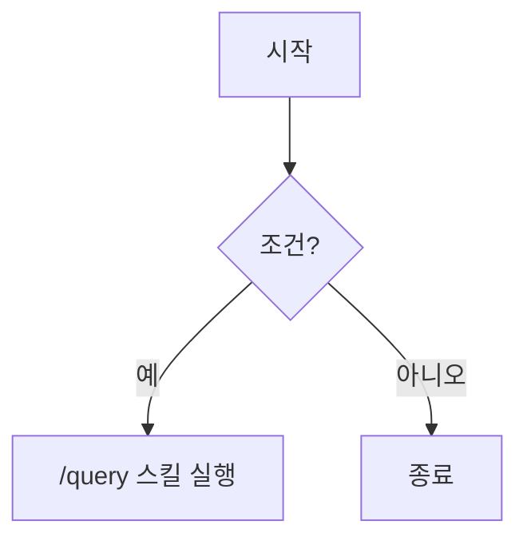

# Mermaid Diagram Rules

Obsidian의 Mermaid 파서는 한글·특수문자·슬래시에 민감하다. 렌더 실패를 예방하려면 아래 규칙을 따른다.

## Rules

1. **모든 노드/엣지 라벨은 큰따옴표로 감쌀 것** — 한글, 공백, 특수문자가 포함된 라벨의 파싱 안정성 확보
2. **`[/` 로 시작하는 라벨 금지** — Mermaid가 trapezoid 도형 시작 기호로 파싱 → lexical error
3. **엣지 라벨(`|...|`)도 따옴표 권장** — 한글/공백이 많으면 파서 실패 가능
4. **라벨 내 마크다운 문법 금지** — `**bold**`, `[[wikilink]]`, backtick 등은 렌더 깨짐
5. **복잡한 플로우는 square layout 선호** — `flowchart TB` + `subgraph LR` 조합

## Syntax Reference

Mermaid의 노드 도형 단축 기호:

| 기호 | 의미 |
|------|------|
| `[라벨]` | 직사각형 |
| `(라벨)` | 둥근 직사각형 |
| `{라벨}` | 마름모 (decision) |
| `[/라벨\]` | trapezoid (사다리꼴) |
| `[\라벨/]` | trapezoid alt (역사다리꼴) |
| `[/라벨/]` | 평행사변형 (lean right) |
| `[\라벨\]` | 평행사변형 alt (lean left) |

→ 슬래시로 시작하는 텍스트 라벨을 쓰려면 **반드시 따옴표**로 감싸야 도형 기호로 오해되지 않음.

## Examples

### ✅ Good



### ❌ Bad

```mermaid
flowchart TD
	A[시작] --> B{조건?}
	B -->|예| C[/query 스킬 실행]
	B -->|아니오| D[종료]
```

위 예시는 다음 오류 발생:
- `A[시작]`: 한글 단독은 보통 OK이나 일관성 위해 따옴표 권장
- `C[/query 스킬 실행]`: **`[/` 는 trapezoid 기호** → Lexical error
- 엣지 라벨 `|예|`: 짧은 한글은 보통 OK이나 longer label에선 실패

## Anti-Patterns

```markdown
❌ C[/query 스킬]           # trapezoid 기호로 파싱됨
❌ D[**Bold Label**]       # 마크다운 문법 금지
❌ E[[[wikilink]]]         # wikilink는 Mermaid가 해석 못 함
```

```markdown
✅ C["/query 스킬"]
✅ D["Bold Label"]         # 강조가 필요하면 style 클래스로
✅ E["wikilink text"]      # 링크는 click 이벤트로 별도 처리
```

## Related

- Obsidian Mermaid 스킬: `obsidian-mermaid`
- Mermaid 공식: https://mermaid.js.org/syntax/flowchart.html
